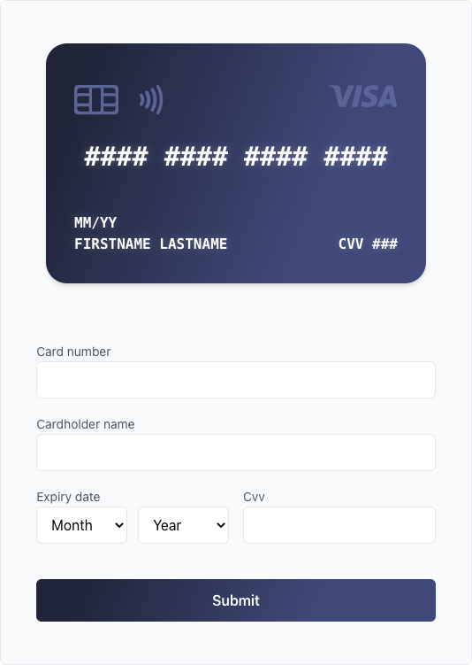

# Queenslab codetest
This is my attempt at the [Queenslab frontend code challenge](https://github.com/QueensLabOpen/EvaluationAssignment/tree/master/Frontend), consisting of two parts:

- [Algorithms](#algorithms)
- [Components](#components)
    
## Algorithms

### First algorithm

#### Task
Write a function that finds and removes instances of four identical consecutive lowercase letters. The function should delete as a few letters as possible.

Assume that the maximum length of the string is 150 000 however please elaborate on changes you would do if the maximum length would be 20 million or higher?

#### Solution
```
function removeRecurring(str) {
  if (typeof str === 'string') {
    return str.replaceAll(/([a-zåäö])\1{3}/g, '$1$1$1')
  } else return console.log('Given value is not a string 😜')
}
```

The above function uses regular expression to target groups within a given string, where the three following characters are identical to the first, totalling in four identical consecutive lowercase characters per group.

The built in Js function replaceAll then uses the same regex reference to replace all identified groups with instances of four consecutive and identical lowercase characters with three characters of the same type.

The worst case time complexity for this function should be O(n) regardless of the number of characters within the given string, because the search is linear. I wasn't really sure how to improve on this further when comparing a string of for example 150k characters to a string of 20 million characters, seeing as I would still have to search the string from beginning to end.

### Second algorithm

#### Task
Write a function that takes an array of numbers and returns the maximum sum of two numbers whose digits have an odd sum.

Assume that the array contains between 1 and 150 000 elements and that each element is within the range of 1 to 1 500 000.

#### Solution
```
function getMaxOddSum(arr) {
  let maxEven = null
  let maxOdd = null
  let impossible = false

  arr.sort((a, b) => {
    return a - b
  })

  for (let num = arr.length - 1; num >= 0; num--) {
    if (arr[num] % 2 === 0 && maxEven == null) {
      maxEven = arr[num]
    } else if (arr[num] % 2 !== 0 && maxOdd == null) {
      maxOdd = arr[num]
    } else if (num === 0) {
      impossible = true
    } else break
  }

  if (impossible === true && (maxEven === null || maxOdd === null)) {
    return console.log('Impossible to calculate 🥺')
  } else return maxEven + maxOdd
}
```

This function sorts the contents of a given array by size. It then loops through the array, starting at the end (largest), and looks for the largest two even and odd numbers. The value returned by the function is the sum of these two numbers (because an odd sum always has one even and one odd addend).

The for loop should also be able to handle situations where a calculation is not possible, i.e. if the array is of length 1, or if all the indexes in the array contain either even or odd numbers. The function then logs in the console that a calculation can not be made from the given array.

## Components

### Task
Create a credit card form for submitting payments. Use either React or Vue and bundle it using either webpack or parcel and deploy it to a cloud provider of your choosing. If you're unsure we can recommend Netlify or Heroku. Focus should be on validation and ease of use.

* Consider what we can validate / detect without making a request to the payment server.
* Include unit / e2e tests
* Bundle your module with webpack or parcel.

### Solution
The contents of this repository contribute to solving the last part of the code challenge, together with [this live example](https://livmari.github.io/queenslab-codetest/). I hope Github pages is a good enough solution for a cloud provider.

* *Consider what we can validate / detect without making a request to the payment server.*
    + I used Yup and Formik to validate the form input data, as well as some basic css to indicate to the end-user if something has gone wrong.
    + The only thing I didn't think to validate was the card type (i.e. 'Visa', 'Mastercard', etc), mainly because I didn't have the time to. Had this been done it would have ensured that the card number length corresponded to the card type.
* *Include unit / e2e tests*
    + The testing included in the app dev env really only makes sure that the app components don't crash on render. If I had more time I would have made the tests more comprehensive.
* *Bundle your module with webpack or parcel.*
    + I've never done this before. I've relied on `create-react-app` without bundling because I've only built smaller projects from scratch until now.
    + I know that `create-react-app` uses Webpack and Babel, so technically it's halfway there, but I understand that the intention of the code test was to see that I could bundle and deploy.
    + I've created another project where I've tried to use Parcel to bundle the app code, however I couldn't get tailwindcss to work with it, so I resorted to this solution instead.

### Component sneak peak
[Click here for live example](https://livmari.github.io/queenslab-codetest/), or visit https://livmari.github.io/queenslab-codetest/

